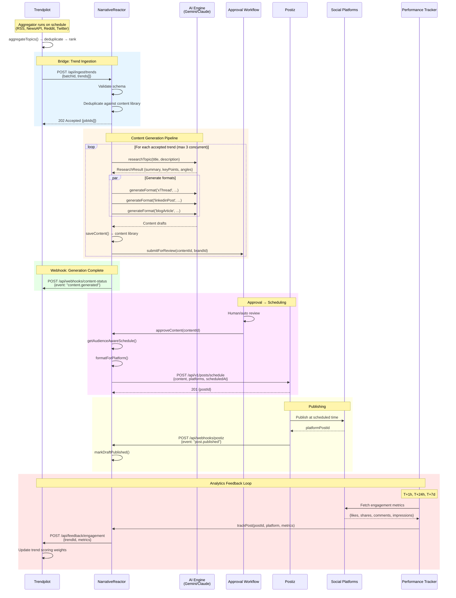
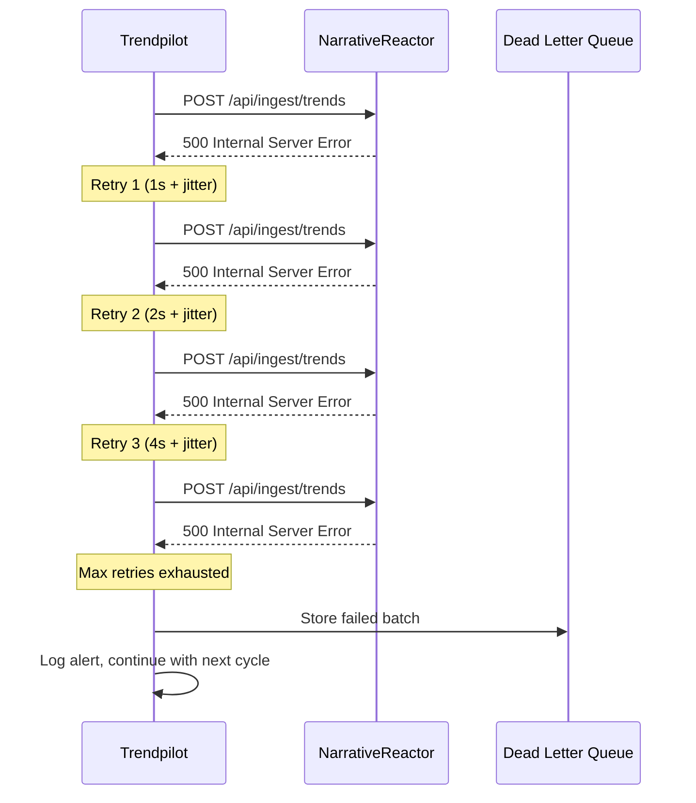
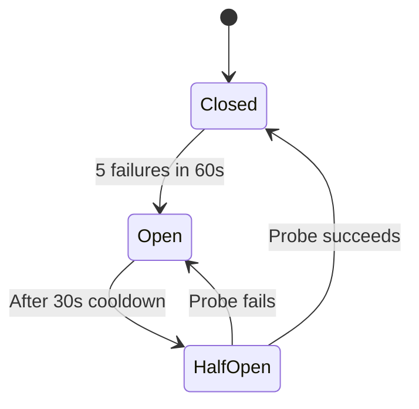

# Trendpilot ↔ NarrativeReactor Bridge Architecture

> **Version:** 1.0.0  
> **Date:** 2026-03-03  
> **Author:** Agent 3 (Bridge Architect)  
> **Status:** Production Spec

---

## 1. Overview

This document specifies the integration bridge connecting **Trendpilot** (trend discovery & scoring) with **NarrativeReactor** (AI content generation & publishing), and how **Postiz** fits as the final scheduling/publishing layer.

### System Roles

| System | Role | Port (default) |
|--------|------|----------------|
| **Trendpilot** | Aggregates trends from RSS, NewsAPI, Reddit, Twitter. Deduplicates, ranks by recency + virality composite score. | `:3500` |
| **NarrativeReactor** | AI content generation (Gemini/Claude), multi-format drafts (X thread, LinkedIn, blog), brand compliance, approval workflows, performance tracking. | `:3000` |
| **Postiz** | Social media scheduling & publishing. Receives approved content for calendar-based distribution. | `:5000` (or SaaS) |

### Data Flow Summary

```
Trendpilot → [Bridge API] → NarrativeReactor → [Approval Queue] → Postiz → [Social Platforms]
                                    ↑                                              │
                                    └──────── Analytics Feedback ←─────────────────┘
```

---

## 2. Bridge API Contract

### 2.1 Trend Ingestion Endpoint

**NarrativeReactor** exposes a new endpoint for Trendpilot to push discovered trends.

```
POST /api/ingest/trends
Content-Type: application/json
X-API-Key: <shared-secret>
```

#### Request Schema: `TrendPayload`

```json
{
  "source": "trendpilot",
  "batchId": "uuid-v4",
  "timestamp": "2026-03-03T05:00:00Z",
  "trends": [
    {
      "id": "tp-abc123",
      "title": "AI Agents Replace SaaS Dashboards",
      "description": "Growing trend of AI agents handling tasks previously done through SaaS interfaces.",
      "url": "https://example.com/article",
      "source": "news-api",
      "sources": ["news-api", "reddit"],
      "publishedAt": "2026-03-03T02:30:00Z",
      "score": 0.87,
      "viralityScore": 0.92,
      "tags": ["ai-agents", "saas", "automation"],
      "imageUrl": "https://example.com/image.jpg",
      "category": "technology",
      "keywords": ["AI agents", "SaaS replacement", "automation"],
      "metadata": {
        "mentionCount": 142,
        "sentimentScore": 0.7,
        "velocityHr": 34.5
      }
    }
  ],
  "filters": {
    "minScore": 0.5,
    "maxAge": "24h",
    "niches": ["fintech", "ai", "marketing"]
  }
}
```

#### JSON Schema (Formal)

```jsonschema
{
  "$schema": "http://json-schema.org/draft-07/schema#",
  "title": "TrendPayload",
  "type": "object",
  "required": ["source", "batchId", "timestamp", "trends"],
  "properties": {
    "source": { "type": "string", "const": "trendpilot" },
    "batchId": { "type": "string", "format": "uuid" },
    "timestamp": { "type": "string", "format": "date-time" },
    "trends": {
      "type": "array",
      "minItems": 1,
      "maxItems": 50,
      "items": {
        "type": "object",
        "required": ["id", "title", "source", "publishedAt", "score"],
        "properties": {
          "id": { "type": "string" },
          "title": { "type": "string", "maxLength": 500 },
          "description": { "type": "string", "maxLength": 2000 },
          "url": { "type": "string", "format": "uri" },
          "source": { "type": "string", "enum": ["news-api", "rss", "reddit", "twitter"] },
          "sources": {
            "type": "array",
            "items": { "type": "string", "enum": ["news-api", "rss", "reddit", "twitter"] }
          },
          "publishedAt": { "type": "string", "format": "date-time" },
          "score": { "type": "number", "minimum": 0, "maximum": 1 },
          "viralityScore": { "type": "number", "minimum": 0, "maximum": 1 },
          "tags": { "type": "array", "items": { "type": "string" } },
          "imageUrl": { "type": "string", "format": "uri" },
          "category": { "type": "string" },
          "keywords": { "type": "array", "items": { "type": "string" } },
          "metadata": { "type": "object", "additionalProperties": true }
        }
      }
    },
    "filters": {
      "type": "object",
      "properties": {
        "minScore": { "type": "number" },
        "maxAge": { "type": "string" },
        "niches": { "type": "array", "items": { "type": "string" } }
      }
    }
  }
}
```

#### Response

**Success (202 Accepted):**
```json
{
  "batchId": "uuid-v4",
  "accepted": 5,
  "rejected": 1,
  "rejections": [
    { "trendId": "tp-xyz", "reason": "duplicate", "existingContentId": "nr-abc" }
  ],
  "jobIds": ["job-001", "job-002", "job-003", "job-004", "job-005"]
}
```

**Error (4xx/5xx):**
```json
{
  "error": "validation_failed",
  "message": "trends[2].score must be between 0 and 1",
  "batchId": "uuid-v4"
}
```

### 2.2 Content Generation Status Callback

Trendpilot can poll or receive webhooks for generation status.

```
GET /api/ingest/trends/status/{jobId}
```

```json
{
  "jobId": "job-001",
  "trendId": "tp-abc123",
  "status": "completed",
  "contentId": "nr-draft-456",
  "draftId": "uuid-v4",
  "formats": ["xThread", "linkedinPost", "blogArticle"],
  "workflowState": "review",
  "createdAt": "2026-03-03T05:01:30Z"
}
```

**Status values:** `queued` | `processing` | `completed` | `failed` | `duplicate`

### 2.3 Webhook (Optional, Preferred)

NarrativeReactor pushes status updates to Trendpilot:

```
POST {TRENDPILOT_URL}/api/webhooks/content-status
```

```json
{
  "event": "content.generated",
  "jobId": "job-001",
  "trendId": "tp-abc123",
  "contentId": "nr-draft-456",
  "status": "completed",
  "timestamp": "2026-03-03T05:01:30Z"
}
```

---

## 3. NarrativeReactor Processing Pipeline

When a trend batch arrives at `/api/ingest/trends`, NarrativeReactor:

1. **Validates** the payload against the JSON schema
2. **Deduplicates** — checks content library for existing content matching trend IDs or title similarity (>0.85 cosine)
3. **Queues** accepted trends into a processing queue (FIFO, max concurrency: 3)
4. **For each trend:**
   a. Calls `researchTopic(trend.title, trend.description)` — AI research step
   b. Calls `runContentPipeline({ topic, context, brandGuidelines })` — generates X thread, LinkedIn post, blog article in parallel
   c. Saves to content library via `saveContent()` with `type: 'trend-generated'` and `trendId` metadata
   d. Submits to approval workflow via `submitForReview(contentId, brandId)`
   e. Fires webhook/updates job status to `completed`

### Content Library Metadata for Trend-Generated Content

```json
{
  "type": "trend-generated",
  "title": "AI Agents Replace SaaS Dashboards",
  "tags": ["ai-agents", "saas", "automation"],
  "platform": "twitter",
  "trendId": "tp-abc123",
  "trendSource": "news-api",
  "trendScore": 0.87,
  "batchId": "uuid-v4",
  "brief": { "...ContentBrief..." }
}
```

---

## 4. Feedback Loop: Engagement → Trend Scoring

### 4.1 Engagement Data Endpoint (Trendpilot receives)

```
POST {TRENDPILOT_URL}/api/feedback/engagement
Content-Type: application/json
X-API-Key: <shared-secret>
```

```json
{
  "source": "narrative-reactor",
  "entries": [
    {
      "trendId": "tp-abc123",
      "contentId": "nr-draft-456",
      "platform": "twitter",
      "publishedAt": "2026-03-03T12:00:00Z",
      "metrics": {
        "likes": 234,
        "shares": 87,
        "comments": 45,
        "impressions": 12400,
        "clicks": 312,
        "engagementRate": 0.054
      },
      "measuredAt": "2026-03-04T12:00:00Z"
    }
  ]
}
```

### 4.2 How Trendpilot Uses Feedback

Trendpilot's ranker currently uses a simple composite:

```
composite = recencyScore * 0.5 + viralityScore * 0.5
```

With feedback, this evolves to a **weighted scoring model**:

```
composite = recencyScore * W_r + viralityScore * W_v + contentPerformanceScore * W_p
```

Where:
- `W_r = 0.35` (recency)
- `W_v = 0.35` (virality)  
- `W_p = 0.30` (historical content performance for similar tags/categories)

`contentPerformanceScore` is derived from the engagement feedback:
- Topics whose tags historically produce high-engagement content get boosted
- Categories with low engagement get dampened
- This creates a **reinforcement loop**: good-performing trend categories get prioritized

### 4.3 Feedback Collection Schedule

NarrativeReactor's `performanceTracker` collects metrics and pushes feedback:
- **T+1h** after publish: Early signal (impressions, initial engagement)
- **T+24h**: Primary measurement window
- **T+7d**: Long-tail performance (blog articles, LinkedIn posts)

---

## 5. Postiz Integration

### 5.1 Flow: Approved Content → Postiz

When content moves to `approved` state in the approval workflow:

1. NarrativeReactor's `postingScheduler` calculates optimal posting time using `getAudienceAwareSchedule()`
2. Formats content for each target platform via `formatForPlatform()`
3. Sends to Postiz scheduling API:

```
POST {POSTIZ_URL}/api/v1/posts/schedule
Authorization: Bearer <postiz-api-key>
```

```json
{
  "content": "📈 AI Agents Replace SaaS Dashboards\n\nFresh take on why it matters now...\n\n#AIAgents #SaaS",
  "platforms": ["twitter", "linkedin"],
  "scheduledAt": "2026-03-04T14:30:00Z",
  "metadata": {
    "sourceSystem": "narrative-reactor",
    "contentId": "nr-draft-456",
    "trendId": "tp-abc123",
    "draftId": "uuid-v4"
  }
}
```

### 5.2 Postiz Webhook → NarrativeReactor

Postiz fires webhooks on publish events:

```
POST {NARRATIVE_REACTOR_URL}/api/webhooks/postiz
```

```json
{
  "event": "post.published",
  "postId": "postiz-789",
  "platform": "twitter",
  "publishedAt": "2026-03-04T14:30:05Z",
  "platformPostId": "twitter-1234567890",
  "metadata": {
    "contentId": "nr-draft-456",
    "trendId": "tp-abc123"
  }
}
```

NarrativeReactor then:
1. Calls `markDraftPublished(draftId)`
2. Updates approval workflow state to `published`
3. Starts the performance tracking schedule (T+1h, T+24h, T+7d)

---

## 6. Error Handling, Retries & Rate Limiting

### 6.1 Retry Policy

| Operation | Max Retries | Backoff | Timeout |
|-----------|-------------|---------|---------|
| Trend ingestion (TP → NR) | 3 | Exponential (1s, 2s, 4s) | 30s |
| Content generation (AI calls) | 2 | Exponential (2s, 8s) | 120s |
| Webhook delivery (NR → TP) | 5 | Exponential (5s, 15s, 45s, 135s, 405s) | 10s |
| Postiz scheduling | 3 | Exponential (1s, 2s, 4s) | 15s |
| Feedback push (NR → TP) | 3 | Exponential (5s, 15s, 45s) | 15s |

All retries use **jitter** (±25% randomization) to prevent thundering herd.

### 6.2 Rate Limiting

| Endpoint | Rate Limit | Window |
|----------|-----------|--------|
| `POST /api/ingest/trends` | 10 req/min | Per API key |
| `GET /api/ingest/trends/status/*` | 60 req/min | Per API key |
| `POST /api/feedback/engagement` | 30 req/min | Per API key |
| AI content generation (internal) | 3 concurrent | Global |

Rate limit responses: `429 Too Many Requests` with `Retry-After` header.

### 6.3 Circuit Breaker

Each inter-service connection uses a circuit breaker:
- **Closed** (normal): requests flow through
- **Open** (after 5 consecutive failures in 60s): all requests fail-fast for 30s
- **Half-open**: allows 1 probe request; success → closed, failure → open

### 6.4 Dead Letter Queue

Failed trend ingestions and webhook deliveries that exhaust retries go to a DLQ:
- Stored in `data/dlq.json` (or Redis/Postgres in production)
- Admin endpoint `GET /api/admin/dlq` lists failed items
- `POST /api/admin/dlq/{id}/retry` manually retries

### 6.5 Idempotency

- All trend ingestion is idempotent on `batchId` + `trendId`
- Re-submitting the same batch returns the original job IDs
- Webhook deliveries include `X-Idempotency-Key` header

---

## 7. Authentication & Security

- **Inter-service auth:** Shared API keys via `X-API-Key` header
- **Key rotation:** Support for multiple active keys with `X-API-Key-Version`
- **Transport:** HTTPS required in production; mTLS recommended for service-to-service
- **Payload signing:** Optional HMAC-SHA256 signature in `X-Signature` header for webhook verification:
  ```
  X-Signature: sha256=hex(HMAC(shared_secret, request_body))
  ```

---

## 8. Sequence Diagrams

### 8.1 Full Flow: Trend Discovery → Publishing → Feedback



### 8.2 Error & Retry Flow



### 8.3 Circuit Breaker State Machine



---

## 9. Configuration

### Environment Variables

```bash
# Trendpilot
NARRATIVEREACTOR_URL=http://localhost:3000
NARRATIVEREACTOR_API_KEY=nr-key-xxx
TREND_PUSH_INTERVAL=300          # seconds between trend pushes
TREND_PUSH_MIN_SCORE=0.5         # minimum trend score to push
TREND_PUSH_MAX_BATCH=50          # max trends per batch
FEEDBACK_WEBHOOK_SECRET=shared-secret

# NarrativeReactor
TRENDPILOT_URL=http://localhost:3500
TRENDPILOT_API_KEY=tp-key-xxx
TREND_INGEST_MAX_CONCURRENT=3    # max parallel AI generation jobs
POSTIZ_URL=http://localhost:5000
POSTIZ_API_KEY=pz-key-xxx
WEBHOOK_HMAC_SECRET=shared-secret
```

---

## 10. Database Schema Additions

### Trendpilot: `trend_feedback` table

```sql
CREATE TABLE trend_feedback (
  id UUID PRIMARY KEY DEFAULT gen_random_uuid(),
  trend_id VARCHAR(255) NOT NULL,
  content_id VARCHAR(255) NOT NULL,
  platform VARCHAR(50) NOT NULL,
  likes INT DEFAULT 0,
  shares INT DEFAULT 0,
  comments INT DEFAULT 0,
  impressions INT DEFAULT 0,
  clicks INT DEFAULT 0,
  engagement_rate DECIMAL(5,4) DEFAULT 0,
  measured_at TIMESTAMPTZ NOT NULL,
  created_at TIMESTAMPTZ DEFAULT NOW(),
  UNIQUE(trend_id, content_id, platform, measured_at)
);

CREATE INDEX idx_trend_feedback_trend ON trend_feedback(trend_id);
CREATE INDEX idx_trend_feedback_measured ON trend_feedback(measured_at);
```

### Trendpilot: `tag_performance` materialized view

```sql
CREATE MATERIALIZED VIEW tag_performance AS
SELECT 
  unnest(t.tags) AS tag,
  AVG(f.engagement_rate) AS avg_engagement,
  COUNT(*) AS sample_count,
  MAX(f.measured_at) AS last_measured
FROM trend_feedback f
JOIN topics t ON t.id = f.trend_id
GROUP BY unnest(t.tags);
```

### NarrativeReactor: `trend_jobs` table

```sql
CREATE TABLE trend_jobs (
  id UUID PRIMARY KEY DEFAULT gen_random_uuid(),
  batch_id UUID NOT NULL,
  trend_id VARCHAR(255) NOT NULL,
  status VARCHAR(20) DEFAULT 'queued',
  content_id VARCHAR(255),
  draft_id UUID,
  error TEXT,
  created_at TIMESTAMPTZ DEFAULT NOW(),
  updated_at TIMESTAMPTZ DEFAULT NOW(),
  UNIQUE(batch_id, trend_id)
);

CREATE INDEX idx_trend_jobs_status ON trend_jobs(status);
CREATE INDEX idx_trend_jobs_batch ON trend_jobs(batch_id);
```

---

## 11. Implementation Checklist

### Phase 1: Core Bridge (Week 1-2)
- [ ] NarrativeReactor: Implement `POST /api/ingest/trends` with validation
- [ ] NarrativeReactor: Job queue for trend → content pipeline
- [ ] NarrativeReactor: `GET /api/ingest/trends/status/{jobId}`
- [ ] Trendpilot: Scheduled push of top trends to NarrativeReactor
- [ ] Shared: API key auth on both sides

### Phase 2: Postiz Integration (Week 2-3)
- [ ] NarrativeReactor: Auto-schedule approved content to Postiz
- [ ] NarrativeReactor: Postiz webhook handler for publish events
- [ ] NarrativeReactor: Update draft status on publish confirmation

### Phase 3: Feedback Loop (Week 3-4)
- [ ] NarrativeReactor: Performance metric collection at T+1h/24h/7d
- [ ] NarrativeReactor: `POST /api/feedback/engagement` push to Trendpilot
- [ ] Trendpilot: Feedback ingestion endpoint
- [ ] Trendpilot: Weighted scoring model incorporating content performance
- [ ] Trendpilot: `tag_performance` materialized view + refresh cron

### Phase 4: Resilience (Week 4)
- [ ] Circuit breakers on all inter-service calls
- [ ] DLQ for failed deliveries
- [ ] Idempotency enforcement
- [ ] Webhook HMAC verification
- [ ] Rate limiting middleware
- [ ] Alerting on circuit breaker state changes

---

## 12. Monitoring & Observability

### Key Metrics

| Metric | Type | Alert Threshold |
|--------|------|-----------------|
| `bridge.trends.ingested` | Counter | < 1/hr during business hours |
| `bridge.trends.generation_time_ms` | Histogram | p95 > 60s |
| `bridge.trends.generation_failures` | Counter | > 5/hr |
| `bridge.feedback.push_failures` | Counter | > 3/hr |
| `bridge.circuit_breaker.state` | Gauge | state = open |
| `bridge.dlq.depth` | Gauge | > 10 |
| `bridge.postiz.schedule_failures` | Counter | > 3/hr |

### Health Check

Both services expose health endpoints that include bridge connectivity:

```
GET /api/health
```

```json
{
  "status": "ok",
  "bridge": {
    "trendpilot": { "status": "connected", "lastPing": "2026-03-03T05:10:00Z" },
    "postiz": { "status": "connected", "lastPing": "2026-03-03T05:10:00Z" }
  }
}
```
