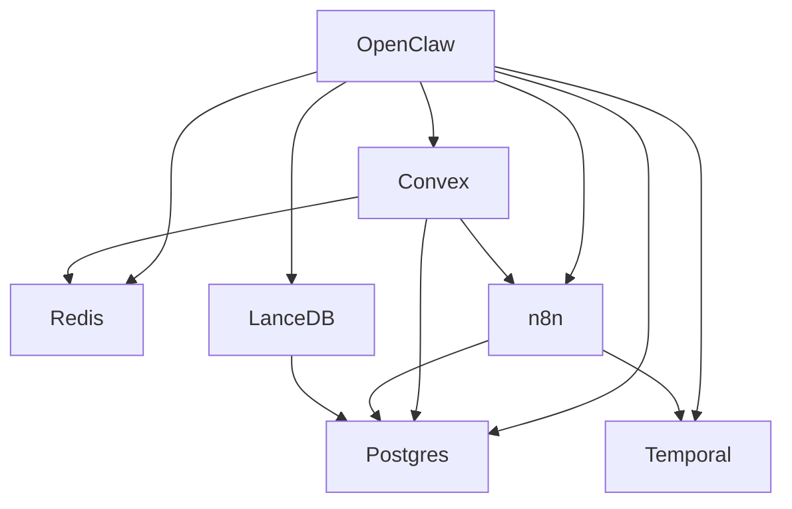

# OpenClaw + Railway Architecture Diagram

_Last updated: 2026-03-13_

## Visual Architecture


(See below for text version & diagram template—image should be exported/rendered from draw.io, Excalidraw, or Mermaid for live use)

---

## Services and Connections

- **OpenClaw Core**
    - Central orchestrator
    - Connects to all subsystems/services
- **Convex**
    - Live data, dashboard, real-time ops state
    - Syncs with Postgres for persistence
- **Postgres**
    - Structured, long-term, analytics
    - All business and agent records
- **LanceDB**
    - Semantically indexed issue/memory/task/search
- **Redis**
    - Pub/Sub, cache, live session/state, queues
- **n8n**
    - Automation, integrates all services and external APIs
- **Temporal.io**
    - Long-lived, durable workflows and job orchestration

All above run on Railway's private network.

### Example Internal Connections

```
OpenClaw <--> Redis / LanceDB / Convex / Postgres / Temporal / n8n
Convex <--> Postgres / Redis / n8n
n8n <--> all (as workflows require)
Temporal <--> all (via task runners)
LanceDB & Postgres (one-way: vector export for reporting)
```

---

## Onboarding Script Templates (for new services)

### 1. ENV Template (`.env` or Railway service variables)

```
# Core connectivity for all agents/services
REDIS_URL=redis://redis.internal:6379
POSTGRES_URL=postgres://postgres.internal:5432/mydb
CONVEX_URL=https://convex.internal:443
LANCEDB_PATH=/mnt/data/lancedb
N8N_URL=https://n8n.internal:5678
TEMPORAL_URL=temporal://temporal.internal:7233
```

### 2. Service Registration/Health Check Script (Python Ex)

```python
import os
import socket
SERVICES = {
  "redis": ("redis.internal", 6379),
  "postgres": ("postgres.internal", 5432),
  "convex": ("convex.internal", 443),
  "lancedb": ("lancedb.internal", 80),
  "n8n": ("n8n.internal", 5678),
  "temporal": ("temporal.internal", 7233),
}
def check_service(name, host, port):
    try:
        socket.create_connection((host, port), timeout=2)
        print(f"{name}: OK")
    except Exception as e:
        print(f"{name}: FAIL — {e}")
for name, (host, port) in SERVICES.items():
    check_service(name, host, port)
```

### 3. Adding a New Service Steps

1. Add the service to Railway with private networking enabled.
2. Give it all required env vars above (and any service-specific keys).
3. Add entries to `infra/CONNECTIONS.md` and, if needed, to MANIFEST.md for rules.
4. Run the health check script from within any service container to verify all service endpoints are reachable.
5. Update architecture diagram PNG/SVG or use the Mermaid template below for quick onboarding and doc tracking.

### 4. Diagram Template (Mermaid)



---

## Best Practice
- Version and audit your infra docs in git alongside code
- Auto-run health checks and endpoint listing as a Railway cron or preflight step on all deploys
- Every new service or mesh element gets registered, variables set, and health-tested from Day 1

For code examples in Node/Go or other workflow automation, just ask. You can auto-consume `/infra/CONNECTIONS.md` in setup scripts for even more streamlined onboarding.